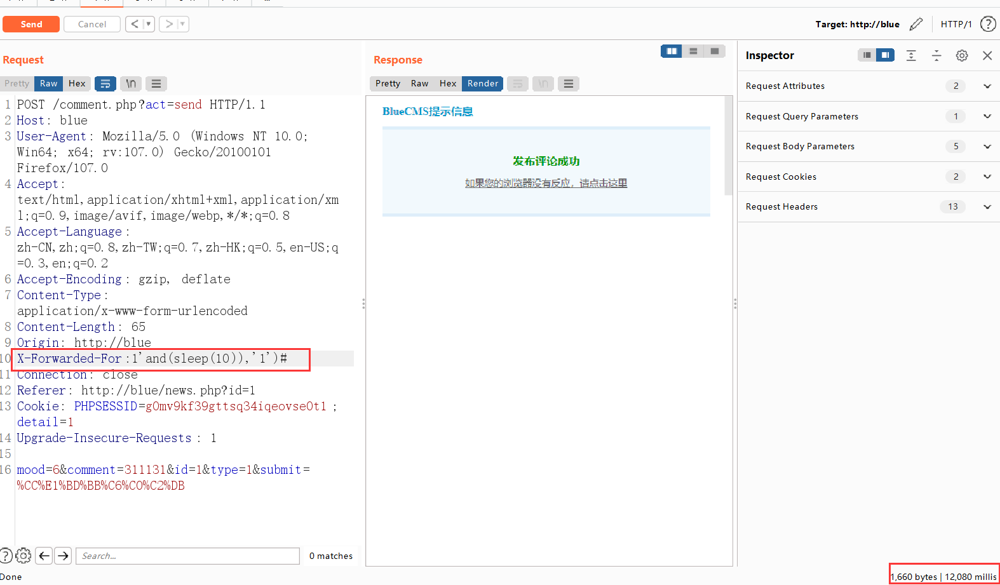

# BLUgCMS代码审计 SQL注入详解

​		在web安全的学习初期，大多数人都处于一个学习使用payload的一个过程，可能只是粗略的了解(背诵)了一下漏洞的基本原理，就直接可以利用一些简单的POC搞一些靶场或者是CTF题了。

​		但是学习了一段时间后，可能逐渐在往脚本小子的方向走，可以胜任一些简单的安全测试项目，只会利用漏洞，而不知道在具体代码层面，漏洞是如何修复,怎么产生的。每次漏洞报告上，修复建议可能就是短短的一句话。(当然，这和乙方工作的局限性有关)

本文简单记录一下个人审计bluecms sql注入类漏洞的总结与收获。

## 审计开始

首先查看一下bluecms的对全局接收参数的处理。

文件路径:include/common.inc.php       admin/include/common.inc.php （后台）

过滤代码均为

```
if(!get_magic_quotes_gpc())
{
	$_POST = deep_addslashes($_POST);
	$_GET = deep_addslashes($_GET);
	$_COOKIES = deep_addslashes($_COOKIES);
	$_REQUEST = deep_addslashes($_REQUEST);
}// 这边就是将传入的参数中的引号全都进行转义
```

- [ ] get_magic_quotes_gpc()

> 当 magic_quotes_gpc 打开时，所有的 ‘ (单引号), ” (双引号), (反斜线) and 空字符会自动转为含有反斜线的溢出字符。
>
> magic_quotes_gpc设置是否自动为GPC(get,post,cookie)传来的数据中的'”加上反斜线。可以用get_magic_quotes_gpc()检测系统设置

- [ ] deep_addslashes()

> ```
> function deep_addslashes($str)
> {
> if(is_array($str))
> {
>    foreach($str as $key=>$val)
>    {
>       $str[$key] = deep_addslashes($val);
>    }
> }
> else
> {
>    $str = addslashes($str);
> }
> return $str;
> }
> ```

## 漏洞出现点

可以看到，这边全局函数是做了过滤的，使用将单引号转义的方法进行过滤，正常情况下可以防御sql注入。

开发者显然会做防御，但是仍然有疏漏的地方。

**漏洞成因**

> 1. sql查询语句，查询参数未用引号闭合（攻击者不需使用闭合引号的思路进行注入），导致存在数字型sql注入。
> 2. 全局过滤不严，未对超全局变量$_SERVER进行过滤，导致出现XFF注入。
> 3. 使用gbk编码导致出现，宽字节注入问题。

## 数字型注入

文件路径：ad_js.php

关键代码

```
$ad = $db->getone("SELECT * FROM ".table('ad')." WHERE ad_id =".$ad_id);
```

漏洞成因：直接将$ad_id 拼接到sql语句中，没有使用引号闭合，直接存在数字型注入（引号转义对数字型注入无效）

利用：

```
ad_js.php?ad_id=1 union select 1,2,3,4,5,database()
```


修复方案，添加引号

```
$ad = $db->getone("select * from ".table('ad')." where ad_id='$ad_id'");
```

## XFF注入

经过查找，获取ip($_SERVER)的函数为getip()

路径：include/common.fun.php

关键代码

```
function getip()
{
	if (getenv('HTTP_CLIENT_IP'))
	{
		$ip = getenv('HTTP_CLIENT_IP'); 
	}
	elseif (getenv('HTTP_X_FORWARDED_FOR')) 
	{ //获取客户端用代理服务器访问时的真实ip 地址
		$ip = getenv('HTTP_X_FORWARDED_FOR');
	}
	elseif (getenv('HTTP_X_FORWARDED')) 
	{ 
		$ip = getenv('HTTP_X_FORWARDED');
	}
	elseif (getenv('HTTP_FORWARDED_FOR'))
	{
		$ip = getenv('HTTP_FORWARDED_FOR'); 
	}
	elseif (getenv('HTTP_FORWARDED'))
	{
		$ip = getenv('HTTP_FORWARDED');
	}
	else
	{ 
		$ip = $_SERVER['REMOTE_ADDR'];
	}
	return $ip;
}
```

全局查找到2个使用getip()的php文件 

1. comment.php  getip()函数
2. guest_book.php $online_ip （$online_ip = getip();）

### comment.php处XFF注入

关键代码：

```
	$sql = "INSERT INTO ".table('comment')." (com_id, post_id, user_id, type, mood, content, pub_date, ip, is_check) 
 			VALUES ('', '$id', '$user_id', '$type', '$mood', '$content', '$timestamp', '".getip()."', '$is_check')";
```

其中“.getip()”参数可控，但是如何利用获取回显是一个问题。

个人目前有两种思路。

- [ ] 时间盲注

```
1'and(sleep(10)),'1')#    
```



- [x] 利用comment参数回显

查询到 comment参数存在回显


通过控制参数getip(),拼接语句，使得INSERT INTO 插入2次语句，利用comment回显。

payload

```
1','1'),('','1','1','1','6',(database()),'1','1
```

实际执行语句为

```
"INSERT INTO ".table('comment')." (com_id, post_id, user_id, type, mood, content, pub_date, ip, is_check) 
 			VALUES ('', '$id', '$user_id', '$type', '$mood', '$content', '$timestamp', '1','1'),('','1','1','1','6',(database()),'1','1’, '$is_check')";
```

这里我们执行了两次查询。第二个语句才第六个参数$content才是我们利用的地方。


ps，因为第二个语句的大多数值是自己输入，所以时间为默认值，要往下面拖才看的到，并不是在顶层。

### guest_book.php处注入

位置：**guest_book.php**


关键代码

```
//$online_ip参数定义：include/common.inc.php 处$online_ip = getip(); 
elseif ($act == 'send')
{
	$user_id = $_SESSION['user_id'] ? $_SESSION['user_id'] : 0;
	$rid = intval($_POST['rid']);
 	$content = !empty($_POST['content']) ? htmlspecialchars($_POST['content']) : '';
 	$content = nl2br($content);
 	if(empty($content))
 	{
 		showmsg('评论内容不能为空');
 	}
	$sql = "INSERT INTO " . table('guest_book') . " (id, rid, user_id, add_time, ip, content) 
			VALUES ('', '$rid', '$user_id', '$timestamp', '$online_ip', '$content')";
	$db->query($sql);
	showmsg('恭喜您留言成功', 'guest_book.php?page_id='.$_POST['page_id']);
}
```

这边选择用#注释掉引号，在$content参数处执行查询，content同上会回显（不再叙述）

```
X-Forwarded-For:1',database())#
```


修复方案，引号转义处，将超全局变量$SERVER转义。

```
$_SERVER = deep_addslashes($_SERVER);
```

## 宽字节注入

数据库查询编码

```
SHOW VARIABLES LIKE '%char%';
```


> 这边可能有个疑问，为什么单独圈起来这三个显示GBK编码的值，有一些其他编码方式也采用了UTF-8的方式，为什么不可以呢?
>
> ```
> Mysql中有个连接层，何为连接层？
> 在MYSQL中，有一个中间层的结构，负责客户端和服务器之间的连接，称为连接层
> 交互的过程如下：
> （1）客户端(这里指php)以某种字符集生成的SQL语句发送至服务器端(这里指Mysql)，这个“某种字符集”其实是任意规定的，PHP作为客户端连接MYSQL时，这个字符集就是PHP文件默认的编码。
> （2）服务器(Mysql)会将这个SQL语句转为连接层的字符集。问题在于MYSQL是怎么知道我们传过来的这个SQL语句是什么编码呢？这时主要依靠两个MYSQL的内部变量来表示，一个是character_set_client（客户端的字符集）和character_set_connection（连接层的字符集）。
> （3）总的来说，就是php把sql语句传给mysql时，要转换character_set_connection字符集的编码，执行流程就是：将php的sql语句以character_set_client编码（也就是转为16进制数），再将16进制数以character_set_connection进行编码（也就是转换为url编码），然后以内部操作字符集进行url解码，最后以character_set_results编码输出结果
> 内部操作字符集怎么确定？进行内部操作前将请求数据从character_set_connection转换为内部操作字符集，其确定方法如下：
> • 使用每个数据字段的CHARACTER SET设定值;
> • 若上述值不存在，则使用对应数据表的DEFAULT CHARACTER SET设定值(MySQL扩展，非SQL标准);
> • 若上述值不存在，则使用对应数据库的DEFAULT CHARACTER SET设定值;
> • 若上述值不存在，则使用character_set_server设定值。
> ```
>
> 所以只需要以上框起来的三个值为gbk编码就行
>
> 1. character_set_client
> 2. character_set_connection
> 3. character_set_results
>
> 

宽字节注入是全局的问题，这边就尝试个万能密码登陆下后台，qaq

后台登陆

路径：admin/include/common.fun.php

关键代码

```
function check_admin($name, $pwd)
{
	global $db;
	$row = $db->getone("SELECT COUNT(*) AS num FROM ".table('admin')." WHERE admin_name='$name' and pwd = md5('$pwd')");
 	if($row['num'] > 0)
 	{
 		return true;
 	}
 	else
 	{
 		return false;
 	}
}
```

注意这里有个MD5 所以相比较普通的万能语句，需要使用)号闭合。

```
%df') or 2=2#
```


## 总结

1. 看全局过滤，看防御是否完善
2. 使用seay等工具查找执行点，看防御是否有遗漏
3. cms配置问题（存在漏洞配置，GBK编码）