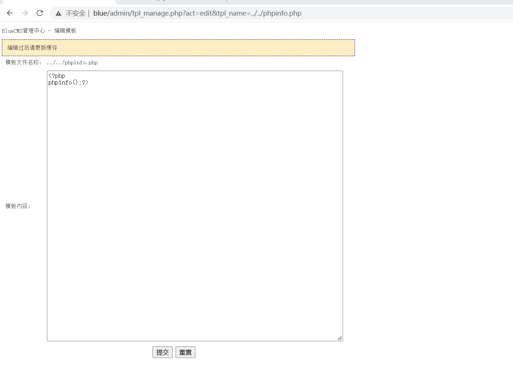

# 任意文件读取

漏洞位置：admin/user.php

漏洞代码：

```
elseif($act == 'edit'){
	$file = $_GET['tpl_name'];
	if(!$handle = @fopen(BLUE_ROOT.'templates/default/'.$file, 'rb')){
		showmsg('打开目标模板文件失败');
	}
	$tpl['content'] = fread($handle, filesize(BLUE_ROOT.'templates/default/'.$file));
	$tpl['content'] = htmlentities($tpl['content'], ENT_QUOTES, GB2312);
	fclose($handle);
	$tpl['name'] = $file;
	template_assign(array('current_act', 'tpl'), array('编辑模板', $tpl));
	$smarty->display('tpl_info.htm');
 }
```


```
$file = $_GET['tpl_name'];
```

$flie可控

```
$handle = @fopen(BLUE_ROOT.'templates/default/'.$file, 'rb'	
```

$flie 参数不经过任何的过滤，直接被fopen()参数打开，所以这边存在任意文件读取漏洞。通过输入系统文件名进行读取。

