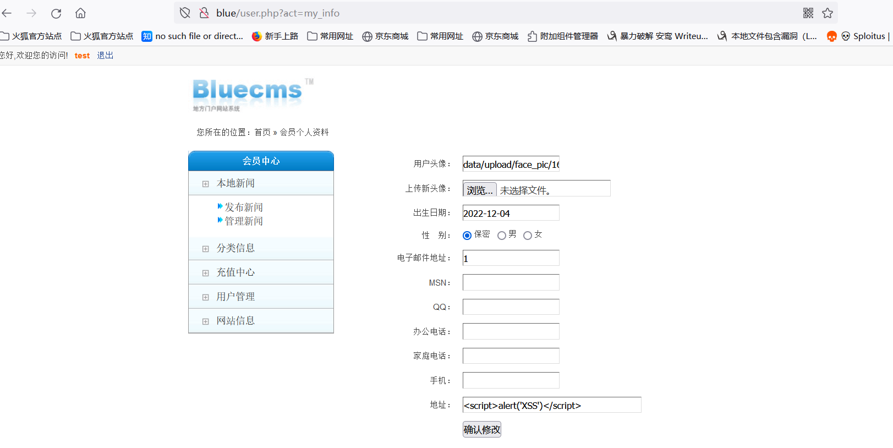
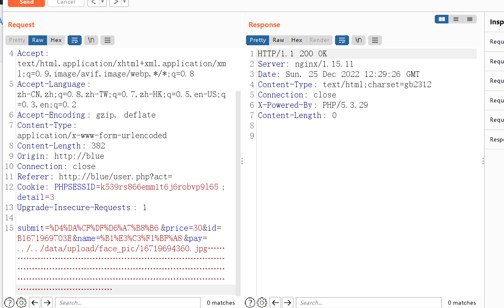
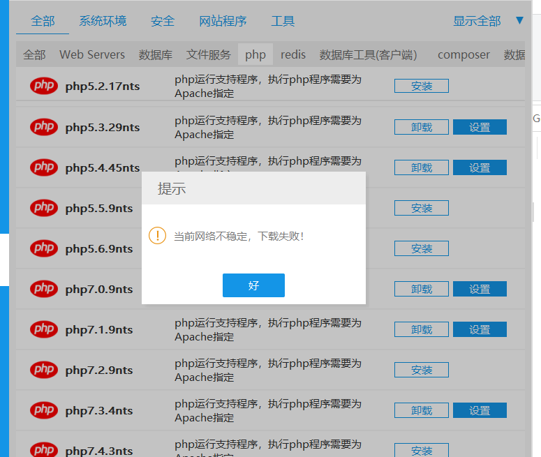

# 文件上传Getshell

漏洞地址:user.php

漏洞代码：

```
 elseif ($act == 'pay'){
 	include 'data/pay.cache.php';
 	$price = $_POST['price'];
 	$id = $_POST['id'];
 	$name = $_POST['name'];
 	if (empty($_POST['pay'])) {
 		showmsg('对不起，您没有选择支付方式');
 	}
 	include 'include/payment/'.$_POST['pay']."/index.php";
 }
```

```
if (empty($_POST['pay'])) {
 		showmsg('对不起，您没有选择支付方式');
 	}
```

参数pay可控

```
include 'include/payment/'.$_POST['pay']."/index.php";
```

这里直接将参数pay当作一层路径名包含了，之后加上一个/index.php结尾。

正常情况下这边是没有问题的，但这边可以使用截断，使得参数pay传递的文件被包含，从而执行。

```
首先是%00 截断，因为post参数有受到addslashes()转义，所以这边行不通
```

```
所以这边考虑使用 多个. 做截断，Windows的路径不能超过256个字符（这里需要PHP版本为5.2版本或一下，本人暂未找到免费资源qaq）
```


最后就是马了，这边可以在个人信息处选择上传一张图片马。



最后就是文件包含了，注意payload要利用../做目录穿越





可以尝试一下这个5.2.17 版本下载，不过可能会失败(.....)