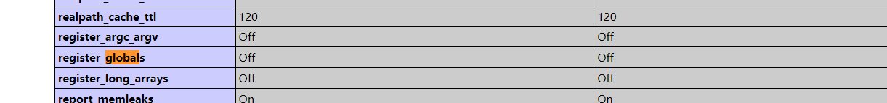

# dedecms 后台全局变量覆盖讲解

最近审计了一下dedecms的历史漏洞，看了不少文章，但是又一个关于变量注册的疑问，在DedeCMS V5.7 SP2中，复现的漏洞有很多部分在接收变量时，并没有说是采用了 $_GET $_POST的方式进行传参。

有些作者是说到使用了register_globals（）

> register_globals是php.ini里的一个配置，这个配置影响到php如何接收传递过来的参数
> register_globals的值可以设置为：On或者Off
> 当register_globals=Off的时候，下一个程序接收的时候应该用$_GET['user_name']和$_GET['user_pass']来接受传递过来的值。（注：当<form>;的method属性为post的时候应该用$_POST['user_name']和$_POST['user_pass']）
> 当register_globals=On的时候，下一个程序可以直接使用$user_name和$user_pass来接受值。
> register_globals的意思就是注册为全局变量，当On的时候，传递过来的值会被直接的注册为全局变量直接使用，而Off的时候，我们需要到特定的数组里去得到它。所以，碰到上边那些无法得到值的问题的时候，应该首先检查一下你的register_globals的设置和你获取值的方法是否匹配。（查看可以用phpinfo()函数或者直接查看php.ini）

 但我用的是php7.3.4，昨天翻了一下phpinfo(), 发现实际上也是关的。



> *PHP从4.20版本开始*,php.ini文件中*register_globals*=off,之前的版本中register_globals =on*PHP从4.20版本开始*,php.ini文件中*register_globals*=off,之前的版本中register_globals =on

根据昨天代码执行问题。

追了下函数

发现问题在**include/common.inc.php**

问题代码

```
function _RunMagicQuotes(&$svar)
{
 /*
 对参数进行过滤
 */
            $svar = addslashes($svar);
        }
    }
//      echo $svar;
    return $svar;
}

if (!defined('DEDEREQUEST'))
{
    //检查和注册外部提交的变量   (2011.8.10 修改登录时相关过滤)
    function CheckRequest(&$val) {
        /*
        检查外部变量
        */
    }

    //var_dump($_REQUEST);exit;
    CheckRequest($_REQUEST);
	CheckRequest($_COOKIE);
	/*
	重点：注册外部提交变量
	*/

    foreach(Array('_GET','_POST','_COOKIE') as $_request)
    {
        foreach($$_request as $_k => $_v)
		{
//            echo $_k;
            echo $_v;
			if($_k == 'nvarname') ${$_k} = $_v;
			else ${$_k} = _RunMagicQuotes($_v);

		}
    }
}
```


> 可以看到程序接收$_request（PHP中的一个超级全局变量）
>
> 使用${$_k} = _RunMagicQuotes($_v)
>
> ```
> ${$_k} = _RunMagicQuotes($_v)
> // _k为 key 的缩写， _v为 value的缩写
> //${$_k} 与$$_k 是都一个意思，这里为声明一个变量名为$k(key),值为$v(value)的变量
> ```
>
> 