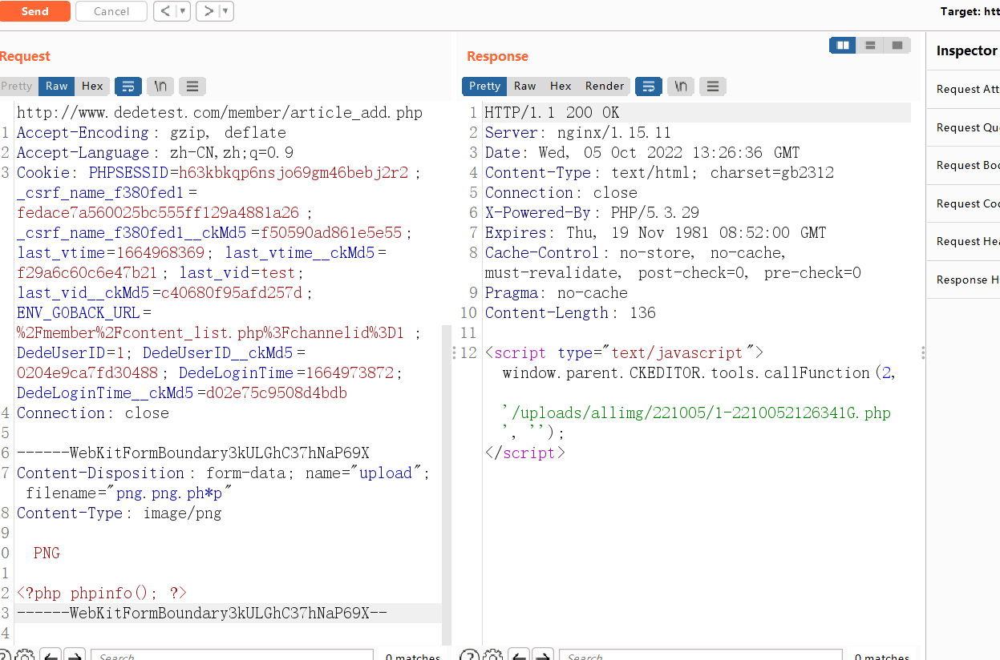
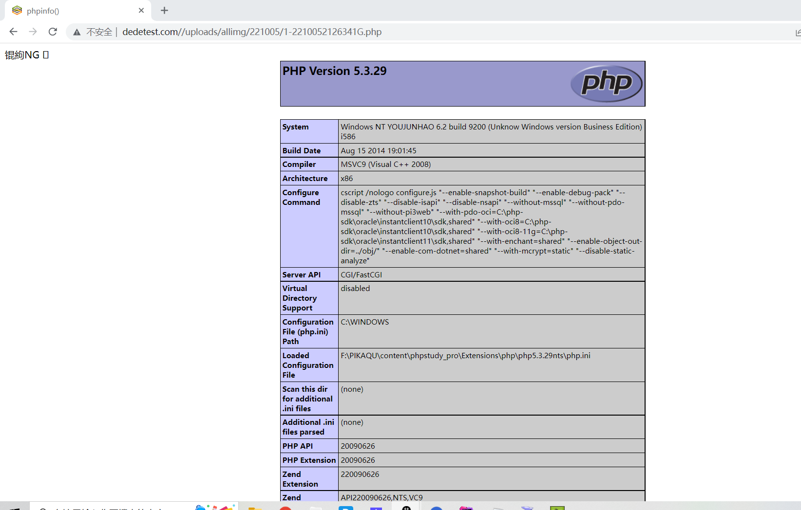

# 前台文件上传-CVE-2018-20129

# 代码分析

首先查看是否有全局过滤函数，追踪到 include/common.inc.php  文件

```
//转换上传的文件相关的变量及安全处理、并引用前台通用的上传函数
if($_FILES)
{
    require_once(DEDEINC.'/uploadsafe.inc.php');
}
```

查看/uploadsafe.inc.php 文件

```
<?php
if(!defined('DEDEINC')) exit('Request Error!');

if(isset($_FILES['GLOBALS'])) exit('Request not allow!');

//为了防止用户通过注入的可能性改动了数据库
//这里强制限定的某些文件类型禁止上传
$cfg_not_allowall = "php|pl|cgi|asp|aspx|jsp|php3|shtm|shtml";
$keyarr = array('name', 'type', 'tmp_name', 'size');
if ($GLOBALS['cfg_html_editor']=='ckeditor' && isset($_FILES['upload']))
{
    $_FILES['imgfile'] = $_FILES['upload'];
    $CKUpload = TRUE;
    unset($_FILES['upload']);
}
foreach($_FILES as $_key=>$_value)
{
    foreach($keyarr as $k)
    {
        if(!isset($_FILES[$_key][$k]))
        {
            exit('Request Error!');
        }
    }
    if( preg_match('#^(cfg_|GLOBALS)#', $_key) )
    {
        exit('Request var not allow for uploadsafe!');
    }
    $$_key = $_FILES[$_key]['tmp_name'];
    ${$_key.'_name'} = $_FILES[$_key]['name'];
    ${$_key.'_type'} = $_FILES[$_key]['type'] = preg_replace('#[^0-9a-z\./]#i', '', $_FILES[$_key]['type']);
    ${$_key.'_size'} = $_FILES[$_key]['size'] = preg_replace('#[^0-9]#','',$_FILES[$_key]['size']);
    if(!empty(${$_key.'_name'}) && (preg_match("#\.(".$cfg_not_allowall.")$#i",${$_key.'_name'}) || !preg_match("#\.#", ${$_key.'_name'})) )
    {
        if(!defined('DEDEADMIN'))
        {
            exit('Not Admin Upload filetype not allow !');
        }
    }
    if(empty(${$_key.'_size'}))
    {
        ${$_key.'_size'} = @filesize($$_key);
    }
    
    $imtypes = array
    (
        "image/pjpeg", "image/jpeg", "image/gif", "image/png", 
        "image/xpng", "image/wbmp", "image/bmp"
    );

    if(in_array(strtolower(trim(${$_key.'_type'})), $imtypes))
    {
        $image_dd = @getimagesize($$_key);
        if (!is_array($image_dd))
        {
            exit('Upload filetype not allow !');
        }
    }
}
?>
```

> $cfg_not_allowall  为黑名单后缀。
>
> ```
>     if(!empty(${$_key.'_name'}) && (preg_match("#\.(".$cfg_not_allowall.")$#i",${$_key.'_name'}) || !preg_match("#\.#", ${$_key.'_name'})) )
>     {
>         if(!defined('DEDEADMIN'))
>         {
>             exit('Not Admin Upload filetype not allow !');
>         }
>     }
>     
> ```
>
> 
>
> ```
> empty()判断是否存在文件名，之后再匹配是为黑名单后缀，和是否有符号 " **.**"（判断是否上传了有后缀文件）。
> 
> **但仔细看 如果上传一个 .php 后缀文件 。1&&(1||1) 不是为真吗，** 这样有阻止上传的效果吗？
> 
> 所以进入嵌套的 if 判断 (!defined('DEDEADMIN')，**DEDEADMIN** 只有在后台登陆时才被定义，用户在前台上传是直接会退出的。
> ```
>
> 这里说人话就是普通用户上传黑名单后缀文件受到限制。


上传界面文件分析 include/dialog/select_images_post.php

```
<?php
/**
 * 图片选择
 *
 * @version        $Id: select_images_post.php 1 9:43 2010年7月8日Z tianya $
 * @package        DedeCMS.Dialog
 * @copyright      Copyright (c) 2007 - 2010, DesDev, Inc.
 * @license        http://help.dedecms.com/usersguide/license.html
 * @link           http://www.dedecms.com
 */
require_once(dirname(__FILE__)."/config.php");
require_once(dirname(__FILE__)."/../image.func.php");


if(empty($activepath))
{
    $activepath ='';
    $activepath = str_replace('.', '', $activepath);
    $activepath = preg_replace("#\/{1,}#", '/', $activepath);
    if(strlen($activepath) < strlen($cfg_image_dir))
    {
        $activepath = $cfg_image_dir;
    }
}

if(empty($imgfile))
{
    $imgfile='';
}
if(!is_uploaded_file($imgfile))
{
    ShowMsg("你没有选择上传的文件!".$imgfile, "-1");
    exit();
}
$CKEditorFuncNum = (isset($CKEditorFuncNum))? $CKEditorFuncNum : 1;
$imgfile_name = trim(preg_replace("#[ \r\n\t\*\%\\\/\?><\|\":]{1,}#", '', $imgfile_name));

if(!preg_match("#\.(".$cfg_imgtype.")#i", $imgfile_name))
{
    ShowMsg("你所上传的图片类型不在许可列表，请更改系统对扩展名限定的配置！", "-1");
    exit();
}
$nowtme = time();
$sparr = Array("image/pjpeg", "image/jpeg", "image/gif", "image/png", "image/xpng", "image/wbmp");
$imgfile_type = strtolower(trim($imgfile_type));
if(!in_array($imgfile_type, $sparr))
{
    ShowMsg("上传的图片格式错误，请使用JPEG、GIF、PNG、WBMP格式的其中一种！","-1");
    exit();
}
$mdir = MyDate($cfg_addon_savetype, $nowtme);
if(!is_dir($cfg_basedir.$activepath."/$mdir"))
{
    MkdirAll($cfg_basedir.$activepath."/$mdir",$cfg_dir_purview);
    CloseFtp();
}
$filename_name = $cuserLogin->getUserID().'-'.dd2char(MyDate("ymdHis", $nowtme).mt_rand(100,999));
$filename = $mdir.'/'.$filename_name;
$fs = explode('.', $imgfile_name);
$filename = $filename.'.'.$fs[count($fs)-1];
$filename_name = $filename_name.'.'.$fs[count($fs)-1];
$fullfilename = $cfg_basedir.$activepath."/".$filename;
move_uploaded_file($imgfile, $fullfilename) or die("上传文件到 $fullfilename 失败！");
if($cfg_remote_site=='Y' && $remoteuploads == 1)
{
    //分析远程文件路径
    $remotefile = str_replace(DEDEROOT, '', $fullfilename);
    $localfile = '../..'.$remotefile;
    //创建远程文件夹
    $remotedir = preg_replace('/[^\/]*\.(jpg|gif|bmp|png)/', '', $remotefile);
    $ftp->rmkdir($remotedir);
    $ftp->upload($localfile, $remotefile);
}
@unlink($imgfile);
if(empty($resize))
{
    $resize = 0;
}
if($resize==1)
{
    if(in_array($imgfile_type, $cfg_photo_typenames))
    {
        ImageResize($fullfilename, $iwidth, $iheight);
    }
}
else
{
    if(in_array($imgfile_type, $cfg_photo_typenames))
    {
        WaterImg($fullfilename, 'up');
    }
}

$info = '';
$sizes[0] = 0; $sizes[1] = 0;
$sizes = getimagesize($fullfilename, $info);
$imgwidthValue = $sizes[0];
$imgheightValue = $sizes[1];
$imgsize = filesize($fullfilename);
$inquery = "INSERT INTO `#@__uploads`(arcid,title,url,mediatype,width,height,playtime,filesize,uptime,mid)
  VALUES ('0','$filename','".$activepath."/".$filename."','1','$imgwidthValue','$imgheightValue','0','{$imgsize}','{$nowtme}','".$cuserLogin->getUserID()."'); ";
$dsql->ExecuteNoneQuery($inquery);
$fid = $dsql->GetLastID();
AddMyAddon($fid, $activepath.'/'.$filename);
$CKUpload = isset($CKUpload)? $CKUpload : FALSE;
if ($GLOBALS['cfg_html_editor']=='ckeditor' && $CKUpload)
{
    $fileurl = $activepath.'/'.$filename;
    $message = '';
    
    $str='<script type="text/javascript">window.parent.CKEDITOR.tools.callFunction('.$CKEditorFuncNum.', \''.$fileurl.'\', \''.$message.'\');</script>';
    exit($str);
}

if(!empty($noeditor)){
	//（2011.08.25 根据用户反馈修正图片上传回调 by:织梦的鱼）
	ShowMsg("成功上传一幅图片！","select_images.php?imgstick=$imgstick&comeback=".urlencode($filename_name)."&v=$v&f=$f&CKEditorFuncNum=$CKEditorFuncNum&noeditor=yes&activepath=".urlencode($activepath)."/$mdir&d=".time());
}else{
	ShowMsg("成功上传一幅图片！","select_images.php?imgstick=$imgstick&comeback=".urlencode($filename_name)."&v=$v&f=$f&CKEditorFuncNum=$CKEditorFuncNum&activepath=".urlencode($activepath)."/$mdir&d=".time());
}
exit();
```

这边主要看2点

> ```
> $imgfile_name = trim(preg_replace("#[ \r\n\t\*\%\\\/\?><\|\":]{1,}#", '', $imgfile_name));
> ```
>
> 这里对文件名进行了转义 "  * ? %  "  等特殊符号会进行置空处理。
>
> ```
> $filename_name = $cuserLogin->getUserID().'-'.dd2char(MyDate("ymdHis", $nowtme).mt_rand(100,999));
> $filename = $mdir.'/'.$filename_name;
> $fs = explode('.', $imgfile_name);
> $filename = $filename.'.'.$fs[count($fs)-1];
> $filename_name = $filename_name.'.'.$fs[count($fs)-1];
> ```
>
>   这里扩展名是直接采用了上传的文件扩展名。

# 利用链

> 上传 png.png.ph*p 文件名
>
> 后台对 ph*p 扩展名的处理过程为：
>
> 1. preg_match("#\.(".$cfg_not_allowall."） **判断扩展名是在黑名单，这边显然不是。**(黑名单做文件上传防御不安全qaq。。)
> 2. $imgfile_name = trim(preg_replace("#[ \r\n\t\*\%\\\/\?><\|\":]{1,}#", '', $imgfile_name)); 将 **p*hp转换为php**
> 3. $fs = explode('.', $imgfile_name);  **将php作为文件扩展名**
> 4. 保存php文件在服务器中
> 5. 其他对于文件是否为空，及判断mime类型，getimagesize()  目标文件的16进制去进行一个读取，去读取头几个字符串是不是符合图片的要求的，都可以在burpsuite中绕过

# 运行结果





