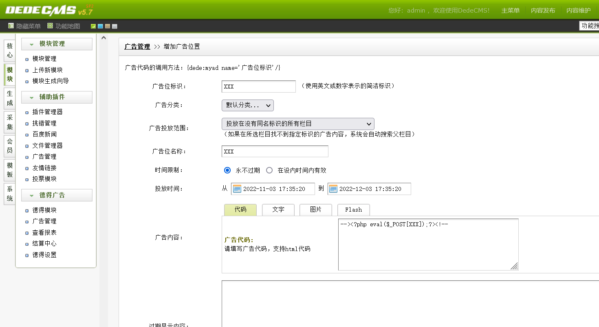
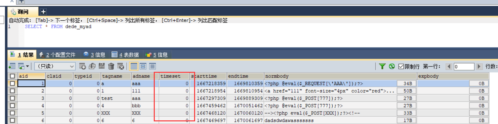
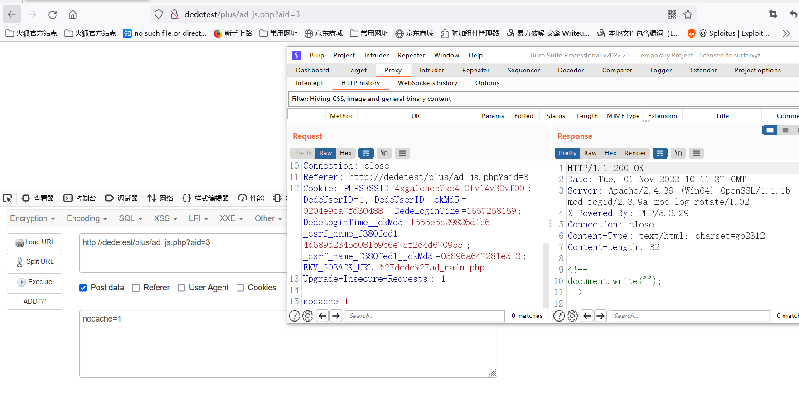
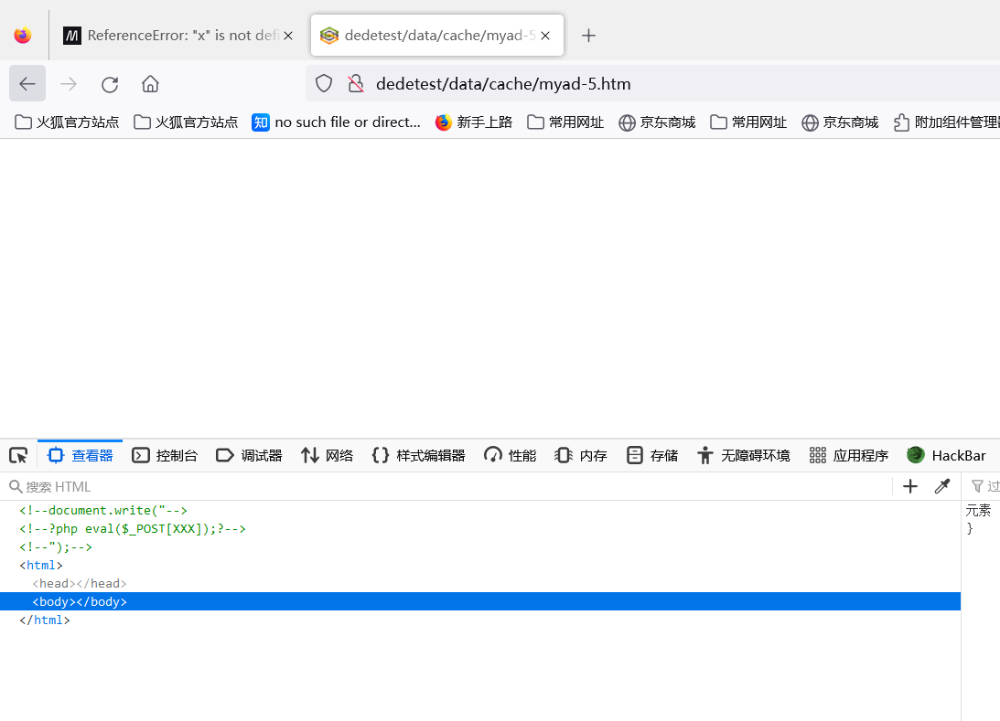
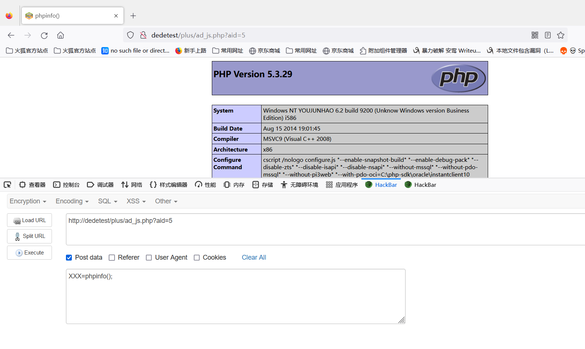

# dedecms 后台Getshell

## 漏洞分析

> $adbody  参数可控，可通过写入cache值从而进入判断语句，从而进行文件包含。

### 路径 plus/ad_js.php

整体代码

```
<?php
/**
 *
 * 广告JS调用方式
 *
 * @version        $Id: ad_js.php 1 20:30 2010年7月8日Z tianya $
 * @package        DedeCMS.Site
 * @copyright      Copyright (c) 2007 - 2010, DesDev, Inc.
 * @license        http://help.dedecms.com/usersguide/license.html
 * @link           http://www.dedecms.com
 */
require_once(dirname(__FILE__)."/../include/common.inc.php");

if(isset($arcID)) $aid = $arcID;
$arcID = $aid = (isset($aid) && is_numeric($aid)) ? $aid : 0;
if($aid==0) die(' Request Error! ');

$cacheFile = DEDEDATA.'/cache/myad-'.$aid.'.htm';
if( isset($nocache) || !file_exists($cacheFile) || time() - filemtime($cacheFile) > $cfg_puccache_time )
{
    $row = $dsql->GetOne("SELECT * FROM `#@__myad` WHERE aid='$aid' ");
    $adbody = '';
    if($row['timeset']==0)
    {
        $adbody = $row['normbody'];
    }
    else
    {
        $ntime = time();
        if($ntime > $row['endtime'] || $ntime < $row['starttime']) {
            $adbody = $row['expbody'];
        } else {
            $adbody = $row['normbody'];
        }
    }
    $adbody = str_replace('"', '\"',$adbody);
    $adbody = str_replace("\r", "\\r",$adbody);
    $adbody = str_replace("\n", "\\n",$adbody);
    $adbody = "<!--\r\ndocument.write(\"{$adbody}\");\r\n-->\r\n";
    $fp = fopen($cacheFile, 'w');
    fwrite($fp, $adbody);
    fclose($fp);
}
include $cacheFile;
```

### 漏洞代码分析

```
$cacheFile = DEDEDATA.'/cache/myad-'.$aid.'.htm'; // 文件路径
/* 或算法
1. 判断 nocache 参数是否传入 传入则为1 进入循环  
2. 判断 cacheFile 是否不存在 不存在则为1 进入循环
3.time() 现在的时间 filemtime() 文件修改的时间 cfg_puccache_time() 缓存时间（dedecms默认36000秒） 如果现在距离文件上一次修改时间超过36000秒，则进入循环
所以这里我们使用1的方式进入判断语句
*/
if( isset($nocache) || !file_exists($cacheFile) || time() - filemtime($cacheFile) > $cfg_puccache_time )
{
/* 查询 aid 参数，如果timeset的值等于0的话，将normbody 的值传入到文件内容*/
    $row = $dsql->GetOne("SELECT * FROM `#@__myad` WHERE aid='$aid' ");
    $adbody = '';
    if($row['timeset']==0)
    {
        $adbody = $row['normbody'];
    }
    else
    {
		***
    }
    /*对adbody进行数据处理*/
    $adbody = str_replace('"', '\"',$adbody);
    $adbody = str_replace("\r", "\\r",$adbody);
    $adbody = str_replace("\n", "\\n",$adbody);
    $adbody = "<!--\r\ndocument.write(\"{$adbody}\");\r\n-->\r\n";
    $fp = fopen($cacheFile, 'w');
    fwrite($fp, $adbody);
    fclose($fp);
}
/*最后进行文件包含操作*/
include $cacheFile;
```

```
上面可知，查询aid这个参数，将其中的一个值当作文件内容写入cacheFile中，之后进行文件包含。
那么aid这个参数是从那来的呢？，全局查看normbody，追踪到dede/ad_add.php，发现是在后台的广告添加模块。
其中normbody 是广告内容。
```

广告模块，normbody写个一句话木马，这里顺便把注释符号给闭合了



查看字段，timeset一直为0。



所以思路来了

> 1. dede/ad_add.php normbody写入一句话木马
> 2. 访问$cacheFile = DEDEDATA.'/cache/myad-'.$aid.'.htm';
> 3. （get post 都可） 传入任意 nocache 
> 4. 进入判断后，由于timeset恒为0，所以 normbody会被传入adbody
> 5. adbody 数据处理后会当作内容写入 $cachefile 文件
> 6. 最后文件包含

访问   域名/plus/ad_js.php?aid=5   （这里的id改成自己的，这时我第5个广告，所以id为5）

传入一个任意cache值，文件写入且被包含。



访问域名/data/cache/myad-5.htm



命令执行

